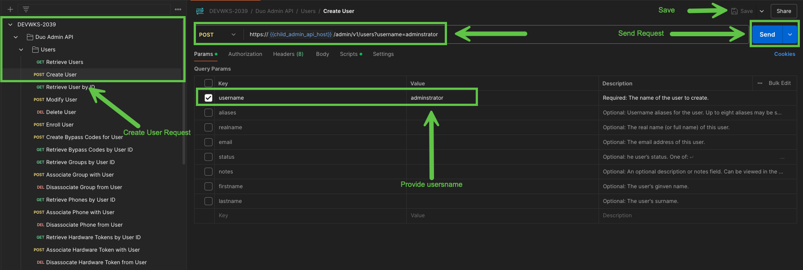

# Task 1: Add a Duo User  

A new employee has joined the team, and they need access to Duo-protected applications. As an IT administrator, your task is to onboard the user by creating their Duo account, registering their phone, and linking the phone to their user profile. This ensures they can securely authenticate when accessing company resources.  

## **1. Create User**  
**Navigate to the** **Duo Admin API** collection >> **Users** >> **Create User**  

1. Go to the **Params** tab and provide a username for the user.  
   - If you are in **seat 1**, name the user `whoami1`.  
   - If you are in **seat 16**, name the user `whoami16`.  
2. Save the changes. Click the **Send** button to execute the API call.  

## **2. Create Phone**  
Navigate to the **Duo Admin API** collection >> **Phones** >> **Create Phone**  

1. Go to the **Params** tab and enter a valid phone number. 
   - If you are in **seat 1**, input the following phone number `7345551201`
   - If you are in **seat 16**, input the following phone number `7345551216`
2. Save the changes. Click the **Send** button to execute the API call.  

## **3. Attach Phone to User**  
**Navigate to the** **Duo Admin API** collection >> **Users** >> **Associate Phone with User**  

1. The `{{user_id}}` and `{{phone_id}}` variables will be automatically populated from the previous API calls.  
2. Save the changes. Click the **Send** button to execute the API call.  

[Contiue to next task](02_Onboard_Duo_Customer.md)
