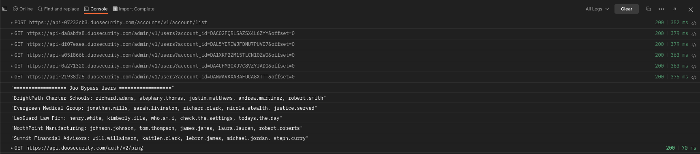

# Task 4: Pull a Report of Users in Bypass Status  

As an IT administrator, you may need to audit and review users who have bypass status enabled. This task will help you retrieve a report of all users currently in bypass mode across multiple Duo accounts.  

## **1. Retrieve Users in Bypass Status**  
**Navigate to the** **Duo Accounts API w/ Admin API** collection >> **Bypass Users** >> **Users in Bypass**  

1. Click the **Send** button to execute the API call.  
2. Review the response to see which users have bypass status enabled.  

[Continue to Next Task](05_Enforce_Security_Policies.md)  
