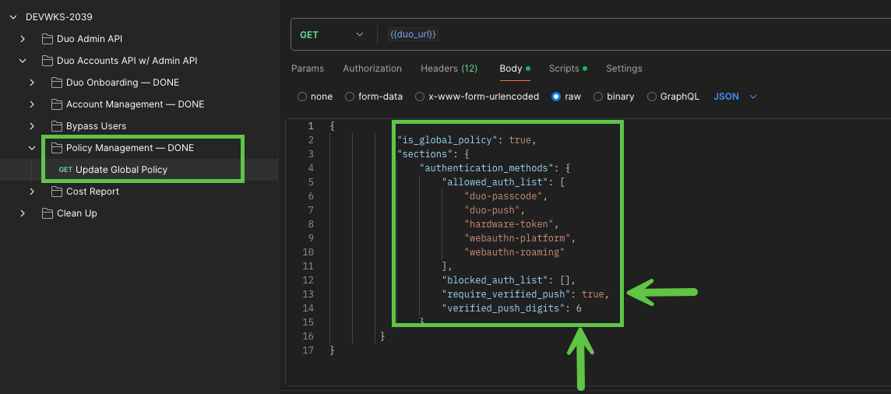

# Task 5: Enforce Security Policies Across Accounts  

A key aspect of Duo's security lies in its policy enforcement. As an IT administrator, there are times when you must apply specific policy settings across all child accounts to ensure uniformity and maintain a strong security posture.
Following a recent security advisory, we have been instructed to disable SMS and phone call authentication as authentication factors across all child accounts and enforce Duo Verified Push for enhanced security.
In this task, you'll enforce verified push authentication with an 8-digit verification code across all Duo client accounts to ensure consistent security.

## **1. Enforce Security Policies**  
**Navigate to the** **Duo Admin API** collection >> **Policy Management** >> **Update Global**  

1. Go to the **Body** tab and configure the following policy settings:  
   - **require_verified_push**: `True`  
   - **verified_push_digits**: `8`  
2. Save the changes.  
3. Click the **Send** button to execute the API call and apply the new policy settings across all child accounts.  

[Continue to Next Task](06_Pull_Cost_Report.md)  
