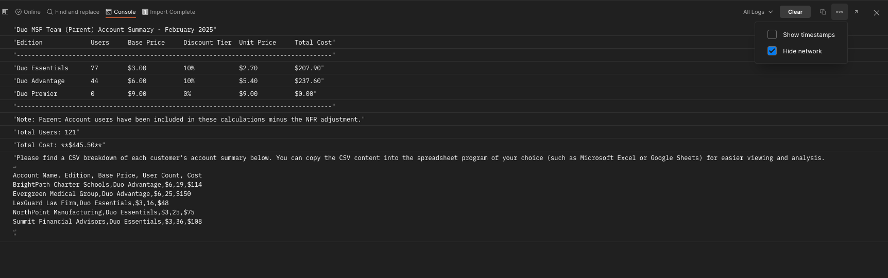

# Task 6: Cost Report  

Our organization's accounting department has requested a real-time usage report to identify the cost of Duo across all client accounts. They need details regarding the **edition count** and the number of **users per edition**. This report will help with financial analysis and cost allocation.  

## **1. Generate the Cost Report**  
**Navigate to the** **Duo Admin API [Child]** collection >> **Cost Report**  

1. Click the **Send** button to execute the API call.  
2. Review the response to see a breakdown of Duo editions and user counts across accounts.

[Complete Lab](https://github.com/it-jonjon/clemea2025-devwks-2039/blob/main/README.md#thank-you-for-participating)  
